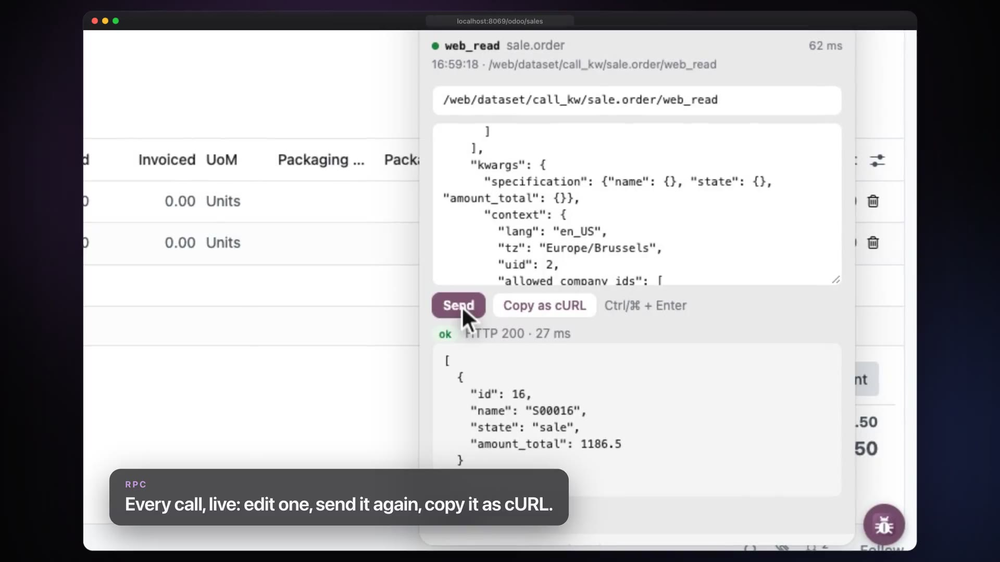
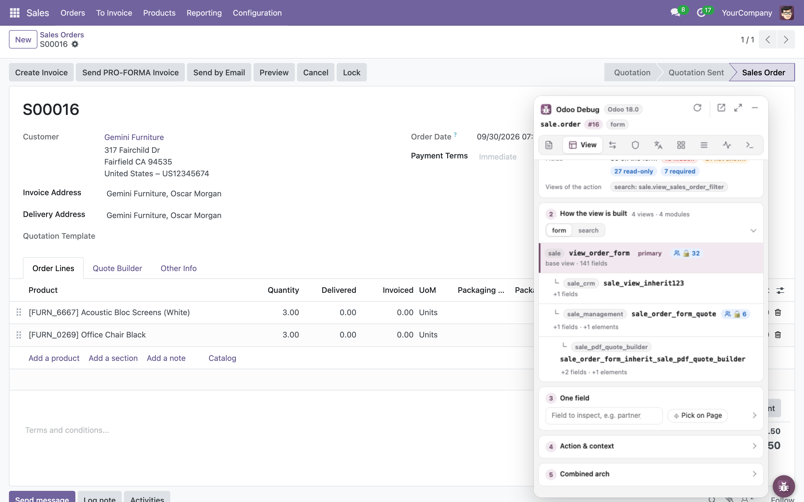
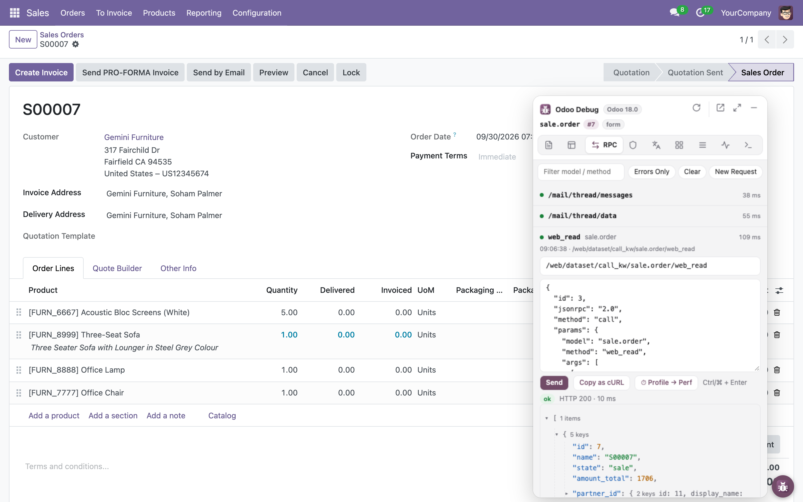
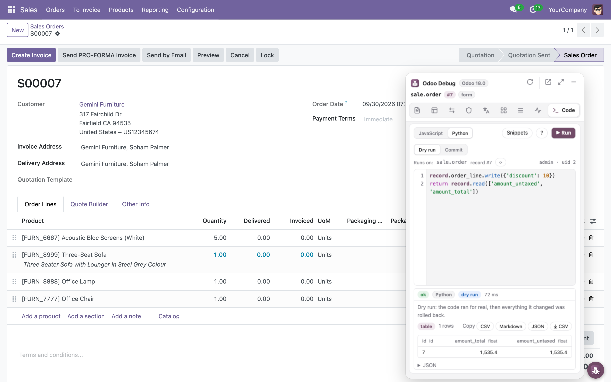
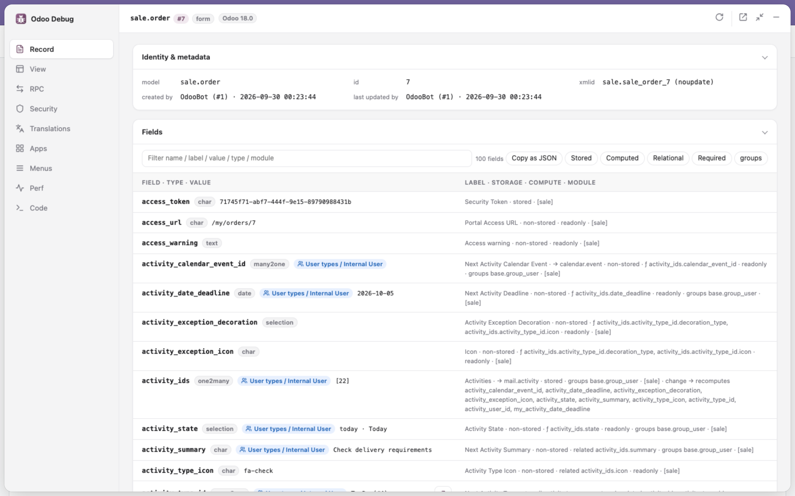
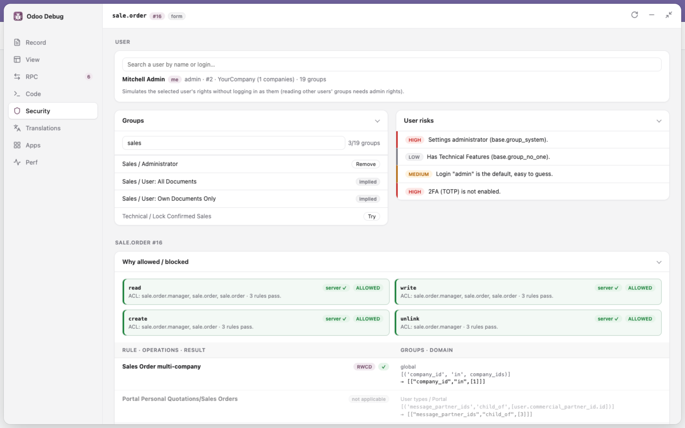
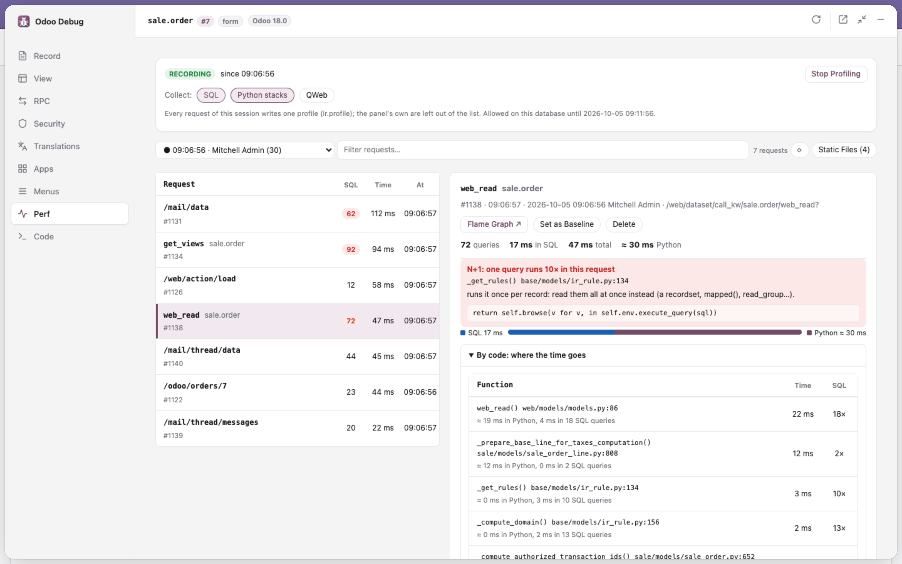
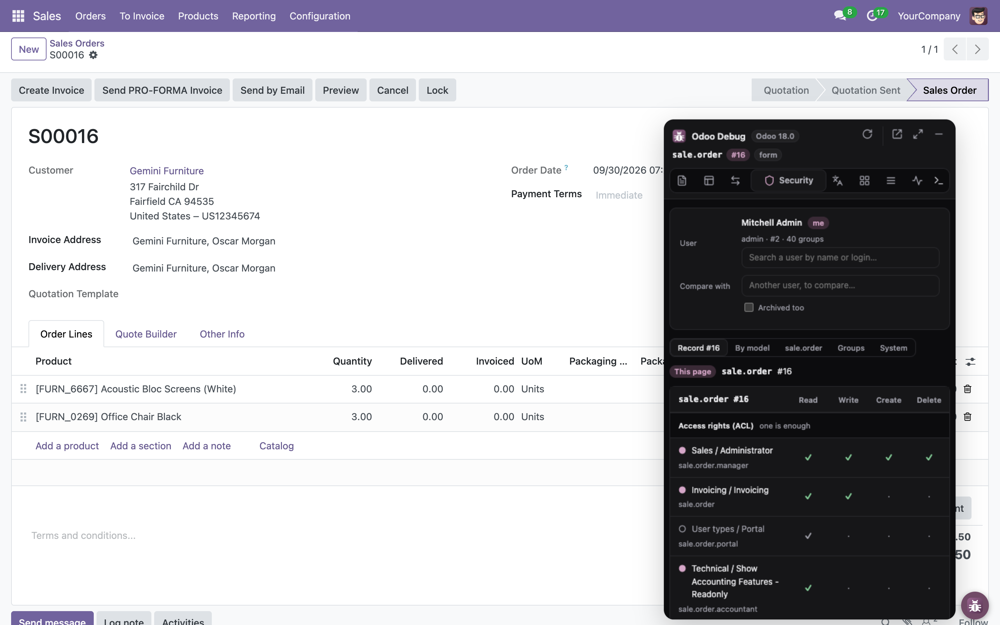

<div align="center">


# Odoo Debug

**Bảng debug ngay trên trang dành cho lập trình viên Odoo.**<br>
Soi record, view, lời gọi RPC, quyền truy cập và hiệu năng server mà không phải rời trang đang debug.

[](https://github.com/unclecatvn/extension-debug-odoo/releases)
[](https://github.com/unclecatvn/extension-debug-odoo/actions/workflows/release.yml)
[](https://github.com/unclecatvn/extension-debug-odoo)


[English](README.md) · **Tiếng Việt**

[Website](https://unclecatvn.github.io/extension-debug-odoo/) · [Cài đặt](#cài-đặt) · [Tính năng](#tính-năng) · [Sử dụng](#sử-dụng) · [Quyền riêng tư](#quyền-riêng-tư--quyền-hạn) · [Phát triển](#phát-triển) · [Changelog](CHANGELOG.md)

<a href="https://unclecatvn.github.io/extension-debug-odoo/"></a>

▶ [Xem phim giới thiệu 87 giây](https://unclecatvn.github.io/extension-debug-odoo/)

</div>

## Vì sao cần Odoo Debug

Chế độ developer có sẵn của Odoo cho bạn biết trên màn hình *có gì*. Odoo Debug cho bạn biết *vì sao*: module nào thêm field này, view kế thừa nào đã sửa form, lời gọi RPC nào lỗi và traceback ra sao, record rule nào chặn một user, request nào bắn ra 50 câu SQL. Tất cả nằm trong một bảng kéo thả được ngay trên trang Odoo, cô lập trong shadow DOM nên không bao giờ đụng tới CSS của Odoo.

## Tính năng

| Tab | Bạn nhận được gì |
|---|---|
| **Record** | Định danh (xmlid, `noupdate`, người tạo / sửa), mọi field kèm kiểu, giá trị, module, cách lưu, nguồn compute / related, `groups=` và các field mà nó kích hoạt tính lại. |
| **View** | Cây kế thừa của view hiện tại (primary + extension, priority, file nguồn), arch đã gộp, thông tin action, modifier của field trên form (`invisible` / `readonly` / `required`) tính đúng như webclient, *Chọn trên trang*. |
| **RPC** | Nhật ký trực tiếp các lời gọi JSON-RPC và JSON-2 từ lúc tải trang: thời gian, lỗi kèm traceback, và nút nhảy sang tab Security khi gặp `AccessError`. **Sửa & Gửi lại** bất kỳ lời gọi nào (route và body JSON) bằng session của trang, hoặc tạo **Request mới**; **Sao chép dạng cURL** để chạy lại ngoài trình duyệt (`call_kw` thành `execute_kw` của API ngoài, dùng API key). |
| **Code** | ORM Console: JavaScript với `env` kiểu ORM (`env['sale.order'].search(…)`, `read`, `mapped`, `write`, mọi method public…) chạy **dưới quyền user đang đăng nhập**, nên server áp ACL, record rule và công ty đang chọn của user đó. Đọc và ghi field như trong Python (`return rec.state`, `rec.state = 'sent'`). Gợi ý model của các module đang cài, field của chúng và method của recordset ngay khi gõ. Mặc định chỉ đọc; tick **Allow Writes** để cho phép ghi, kèm **Auto Refresh** để view trên màn hình tự nạp lại dữ liệu. Kết quả dạng bảng, print, lỗi kèm traceback server, danh sách mọi lời gọi. |
| **Apps** | Với danh sách module gõ tay hoặc tick bên dưới thanh tìm kiếm kiểu Odoo (bộ lọc Đã cài / Chưa cài, Apps / Bổ sung, danh mục, hiện thành facet; mở panel là Đã cài): Activate (Update Apps List rồi cài kèm dependency), Upgrade, Open Forms (cần quyền Settings); nút ⟳ **Update Apps List** riêng, dưới thanh tìm kiếm. |
| **Security** | Ba phần. **User**: tìm user bất kỳ theo tên hoặc login (mặc định là bạn), mọi thẻ đi theo user đó, hoặc đăng nhập thành user đó trong cửa sổ ẩn danh (phiên của bạn giữ nguyên): group (thêm / gỡ, cần quyền Access Rights), đánh giá rủi ro. **Model**: giải thích từng rule vì sao mỗi thao tác được phép hay bị chặn với user đó (với chính bạn, kèm kết quả chính xác `has_access` từ server), ACL, field bị ẩn với user (chỉ dành cho một số group), đánh giá cấu hình. **Instance**: phiên làm việc (db, version, `web.base.url`, `test_mode`; nút **Become Superuser** cho user có quyền Settings), tham số hệ thống (giá trị bí mật được che), kiểm tra (HTTPS, cờ cookie, security header, database manager). |
| **i18n** | **Languages** (cần quyền Settings): bật ngôn ngữ và tải (hoặc tải lại) bản dịch của mọi app đã cài (wizard Add Languages của Odoo, tuỳ chọn Overwrite Existing Terms). Xuất file mẫu `.pot` và một `.po` cho mỗi ngôn ngữ của nhiều app (gõ vào ô là tìm luôn trong các module đã cài; tick chọn hoặc gõ tên) và ngôn ngữ (bấm chọn trong các ngôn ngữ đang bật) bằng wizard có sẵn của Odoo, lưu thẳng vào `Downloads/<module>/i18n/`. |
| **Menus** | Các màn hình kỹ thuật mà developer mở suốt ngày, chỉ một cú bấm, không cần bật debug mode hay vào menu Technical: Models, Fields, Record Rules, Views, Menus, Model Data, Crons, Actions Window, Actions Server, Reports, Parameters, Sequences, Mail Templates (danh sách của module `developer_menu` bên OCA, không phải cài gì; dành cho user có quyền Access Rights). Bấm một dòng là mở màn hình đó ngay trên trang Odoo, như bấm menu; ↗ để mở ở tab mới. |
| **Perf** | Profiler có sẵn của Odoo: bật / tắt, danh sách request đã đo, tổng hợp SQL với các câu lặp lại (nghi N+1), câu chậm nhất, flame graph speedscope. |

Ngoài ra: bấm vào tên field, model hay xmlid trong bảng để copy, và <kbd>⌥ Alt</kbd> + click vào một field trên trang Odoo để copy tên kỹ thuật của nó.

### Ảnh chụp màn hình

<table>
  <tr>
    <td width="50%"><b>View</b>: cây kế thừa và arch đã gộp<br></td>
    <td width="50%"><b>RPC</b>: mọi lời gọi kèm thời gian, sửa và gửi lại<br></td>
  </tr>
</table>

**Code**: gọi ORM bằng JavaScript, dưới quyền user đang đăng nhập.


**Record** ở chế độ toàn màn hình: tab chuyển sang thanh bên trái, các khối bỏ khung, khối ngắn xếp cạnh nhau, và danh sách thành bảng 2 cột với tiêu đề cố định.


**Security**: group của user đã chọn (thêm / gỡ), và vì sao một thao tác được phép hay bị chặn, từng rule một.


**Perf**: các request đã đo, với câu SQL nghi N+1 và các câu chậm nhất của từng request. Ở toàn màn hình, giống tab RPC, danh sách nằm bên trái và request được chọn mở ra bên phải.


<table>
  <tr>
    <td width="50%"><b>Giao diện tối</b><br></td>
  </tr>
</table>

## Cài đặt

Extension chưa có trên Chrome Web Store; cài dạng unpacked (Chrome, Edge, Brave và các trình duyệt nhân Chromium):

1. Tải `odoo-debug-v<version>.zip` từ [Releases](https://github.com/unclecatvn/extension-debug-odoo/releases) rồi giải nén (hoặc `git clone https://github.com/unclecatvn/extension-debug-odoo.git`).
2. Mở `chrome://extensions` và bật **Developer mode**.
3. Bấm **Load unpacked** và chọn thư mục vừa giải nén (nếu clone: chọn thư mục `extension/`).
4. Mở một trang Odoo bất kỳ: nút tròn xuất hiện ở mép dưới.

## Sử dụng

- **Mở / đóng**: bấm nút tròn; bảng mở cạnh nút, đúng tab và vị trí cuộn lần trước. Kéo nút đi đâu cũng được, bảng đi theo nút; vị trí được nhớ riêng cho từng instance Odoo (thả lại gần mép dưới thì nút bám lại mép). Trên các trang không phải Odoo thì không có gì hiện ra, và icon trên thanh công cụ bị làm mờ.
- **Thu nhỏ**: <kbd>−</kbd> trên thanh tiêu đề ẩn bảng về lại nút tròn; bấm nút là mở lại đúng như trước.
- **Toàn màn hình**: <kbd>⤢</kbd> trên thanh tiêu đề của bảng, <kbd>Esc</kbd> hoặc <kbd>⤡</kbd> để thoát. Bố cục giống một editor: tab ở thanh bên trái, tiêu đề một dòng, không khung thẻ, khối ngắn xếp cạnh nhau, editor của tab Code nằm cạnh kết quả, RPC và Perf là danh sách bên trái với chi tiết dòng được chọn bên phải. Nút tròn ẩn đi trong lúc đó (<kbd>−</kbd> để hiện lại). Trạng thái mở và toàn màn hình được giữ khi tải lại trang.
- **Trang hiện tại**: bấm icon extension trên thanh công cụ; một dòng cho biết host, phiên bản Odoo và database của trang, công tắc Off / Debug / Assets cho biết chế độ debug hiện tại và tải lại Odoo ở chế độ được chọn. **Luôn bật cho Odoo này** mở mọi trang của instance đó ở chế độ debug, trừ khi URL chỉ định khác (`?debug=0`).
- **Phím tắt**: <kbd>⌥ Alt</kbd>+<kbd>⇧ Shift</kbd>+<kbd>O</kbd> ẩn / hiện panel, <kbd>⌥ Alt</kbd>+<kbd>⇧ Shift</kbd>+<kbd>D</kbd> bật / tắt debug. Đổi phím trong `chrome://extensions/shortcuts` (nút *Đổi* trong popup).
- **Thẻ**: mỗi tab là một chồng thẻ, ban đầu đều đóng; thẻ chỉ tải dữ liệu khi được mở, và trạng thái mở / đóng được giữ qua các lần tải lại. Bấm vào một dòng trong list để xem chi tiết (nhãn, cách lưu, module, giá trị đầy đủ…), bấm lần nữa để đóng.
- **Copy**: bấm vào tên field, model, xmlid hay tham số trong bảng; <kbd>⌥ Alt</kbd> + click vào field, nhãn, ô trong list, tiêu đề cột trên trang, hoặc một dòng thay đổi trong chatter (*Nháp → Đã gửi (Trạng thái)* copy ra `state`). Giá trị bí mật bị che vẫn copy ra giá trị thật.
- **Tải lại dữ liệu**: <kbd>⟳</kbd>. Dữ liệu ổn định của server (session info, `fields_get`, danh sách user) được cache tới khi tải lại trang; ACL, rule, view và giá trị record luôn được đọc lại.
- **Cài đặt**: bấm icon trên thanh công cụ (hoặc chuột phải → *Options*): ngôn ngữ (English, Tiếng Việt), giao diện màu (Odoo theo hệ thống / sáng / tối, hoặc theme kiểu editor: GitHub Light / Dark, Solarized Light / Dark, Dracula, Monokai, One Dark Pro, Nord, Catppuccin Mocha).

### Tương thích

| | Hỗ trợ |
|---|---|
| Odoo | 18.0, 19.0 |
| Trình duyệt | Chrome và các trình duyệt nhân Chromium (Manifest V3) |
| Ngôn ngữ | English, Tiếng Việt |

Một bản build chạy cho mọi phiên bản: khác biệt được phát hiện lúc chạy (field / route có tồn tại không?), không bao giờ so số phiên bản. Xem [Các phiên bản Odoo](#các-phiên-bản-odoo).

## Quyền riêng tư & quyền hạn

Odoo Debug chỉ nói chuyện với server Odoo của tab bạn đang mở, bằng chính phiên đăng nhập của bạn. Không có backend, không có analytics, không gửi gì đi nơi khác.

| Quyền | Để làm gì |
|---|---|
| `host_permissions: <all_urls>` | Odoo chạy trên bất kỳ tên miền nào; bảng chỉ bật trên những trang được nhận diện là Odoo. |
| `scripting` | Đọc trạng thái webclient (record, view, action hiện tại) từ trang. |
| `cookies` | Báo các cờ của cookie phiên (`Secure`, `HttpOnly`, `SameSite`) trong tab Security. Giá trị cookie không bao giờ bị đọc. |
| `storage` | Lưu cài đặt ngôn ngữ và giao diện. |
| `clipboardWrite` | Copy tên field, xmlid và giá trị. |
| `downloads` | Lưu file `.pot` / `.po` đã xuất vào `Downloads/<module>/i18n/` (tab i18n). |
| `declarativeContent` | Chỉ bật icon trên thanh công cụ ở trang Odoo. |

Dữ liệu Odoo chỉ được đưa vào DOM qua `textContent`, và trang khác không thể nhúng (frame) bảng debug. `odoo.conf` không bao giờ truy cập được từ trình duyệt (Odoo không công khai nó), và extension cũng không thử.

## Phát triển

Không có bước build, không có dependency lúc chạy: sửa code rồi reload extension trong `chrome://extensions`.

```bash
npm test
```

```bash
npm run i18n
```

`npm test` chạy mọi `tests/*.test.mjs` bằng test runner có sẵn của Node; `npm run i18n` trích chuỗi ra `extension/i18n/odoo_debug.pot` và gộp vào mọi file `.po`.

Test end-to-end nạp extension vào Chrome headless (Puppeteer, dev dependency duy nhất) và chạy với Odoo thật dựng bằng Docker; CI chạy chúng trên mọi pull request với Odoo 18 và 19:

```bash
npm ci
```

```bash
ODOO_VERSION=19 docker compose -f e2e/compose.yml up -d --wait
```

```bash
npm run e2e
```

`docker compose -f e2e/compose.yml down -v` xoá database; chạy lệnh này trước khi đổi `ODOO_VERSION`.

Ảnh trong `website/screenshots/` (README này và website) được chụp từ cùng bộ dựng đó, với dữ liệu demo của Sales và CRM; chụp lại sau mỗi lần đổi giao diện:

```bash
ODOO_VERSION=18 ODOO_MODULES=sale_management,crm ODOO_ARGS= docker compose -f e2e/compose.yml up -d --wait
```

```bash
npm run screenshots
```

Phim giới thiệu được quay từ cùng bộ dựng đó: một phiên dùng extension thật, giữ mọi khung hình Chrome vẽ, rồi dựng trong `tools/intro.html` (cửa sổ trên sân khấu tối, máy quay đi theo thao tác, chú thích). Kết quả là `website/intro.mp4`, poster `website/intro-poster.jpg` và bản master 1440p trong `store/`; cần ffmpeg:

```bash
npm run intro
```

### Cấu trúc dự án

```
extension/                 chính extension: đúng những gì có trong file zip release (Load unpacked thư mục này)
  manifest.json
  icons/                   icon của extension (make-icons.sh)
  i18n/                    odoo_debug.pot + en.po, vi.po (đọc lúc chạy, không cần build)
  src/
    background.js          chỉ bật icon trên trang Odoo (declarativeContent)
    popup/                 popup trên thanh công cụ = trang options: ngôn ngữ, giao diện; host, version, db, chế độ debug của trang
    content/               hook.js (MAIN world, ghi lại JSON-RPC), bubble.js (nút kéo thả + iframe của bảng
                           trong shadow root, chuyển tiếp RPC đã ghi tới bảng, copy bằng ⌥/Alt+click)
    panel/                 panel.html / main.js: thanh tiêu đề, các tab, gắn với tab đang nhúng
    shared/                bridge.js (hàm chạy trong trang, RPC, đọc có cache), ui.js + ui.css (DOM, widget, style của bảng và popup),
                           page.js (hàm lõi chạy trong trang), list.js, picker.js, i18n.js, odoo.js, settings.js
    features/<tab>/        mỗi tab một thư mục: record, view, rpc, code, security, translations, apps, menus, perf
      <tab>.js             giao diện tab: render(section, state); tab lớn tách mỗi phần một file (code: suggest.js, help.js)
      page.js              hàm được inject vào trang Odoo (tự chứa, không import)
      logic.js             logic thuần, không chrome.* / DOM
website/                   trang giới thiệu (GitHub Pages); screenshots/ dùng chung với README
tests/                     *.test.mjs, mỗi module logic một file
e2e/                       panel.e2e.mjs (Puppeteer) + compose.yml (Odoo 18 / 19 + PostgreSQL) + odoo.mjs (đăng nhập, mở panel)
tools/i18n.mjs             npm run i18n: trích chuỗi → .pot, gộp vào mọi .po
tools/screenshots.mjs      npm run screenshots: chụp lại website/screenshots/*.png từ Odoo thật
tools/intro.mjs            npm run intro: quay một phiên dùng thật, dựng trong tools/intro.html → website/intro.mp4
```

Các đường dẫn bên dưới tính từ `extension/`.

### Quy ước

- Mọi chuỗi người dùng nhìn thấy đều đi qua `_t('English text %s', value)` (hoặc `N_('…')` ở chỗ `_t` không chạy được, ví dụ hàm chạy trong trang); HTML tĩnh dùng `data-i18n`. Chạy `npm run i18n` rồi dịch các mục mới trong `i18n/vi.po`.
- Dữ liệu ổn định của server đi qua `cached()` trong `shared/bridge.js`; thứ gì có thể đổi trong lúc debug thì luôn đọc lại.

### Các phiên bản Odoo

Không có code riêng cho từng phiên bản. Để hỗ trợ phiên bản khác, kiểm tra các chỗ sau và thêm fallback cạnh fallback sẵn có:

| Điểm khác biệt | Ở đâu |
|---|---|
| Field nhóm của `res.users` (`groups_id` → `group_ids` / `all_group_ids` ở bản 19) | `shared/odoo.js` `pickGroupField` |
| JSON-2 API `/json/2/<model>/<method>` (19) | `content/hook.js`, `features/rpc/logic.js` |
| `ir.profile.cpu_duration` (19), wizard profiling | `features/perf/perf.js` |
| Bên trong webclient: action service `__WOWL_DEBUG__`, `currentState`, `odoo.loader` + `py_js`, `archInfo` của form | `shared/page.js`, `features/view/page.js`, `features/security/page.js` |
| URL `/odoo/…` (bản cũ: `/web#…`) | fallback trong `shared/page.js` |
| Method phía server: `has_access`, `res.users.has_groups`, `get_metadata`, `get_views`, `/web/become` | `features/security`, `features/record`, `features/view` |

Fallback thuần đặt trong `shared/odoo.js` (test ở `tests/odoo.test.mjs` tại thư mục gốc repo). Hàm chạy trong trang không import được nên fallback của chúng viết inline. Khi một chỗ vượt quá vài nhánh, đó mới là lúc thêm adapter, không sớm hơn.

### Phát hành

Tăng `version` trong `extension/manifest.json`, thêm section tương ứng vào [CHANGELOG.md](CHANGELOG.md) rồi push lên `main`: CI tạo tag `v<version>` và đăng file zip với section đó làm release notes. Mỗi gạch đầu dòng trong CHANGELOG viết trên một dòng: release notes của GitHub coi mỗi lần xuống dòng là ngắt dòng thật.

## Đóng góp

Rất hoan nghênh issue và pull request. Trước khi mở PR:

1. `npm test` chạy qua và `npm run i18n` không làm thay đổi `extension/i18n/` (CI kiểm tra cả hai).
2. Chuỗi mới đã được dịch trong `extension/i18n/vi.po`.
3. Đã thử trên ít nhất một instance Odoo; ghi rõ phiên bản trong PR.

Gặp lỗi? [Mở issue](https://github.com/unclecatvn/extension-debug-odoo/issues) kèm phiên bản Odoo, trang bạn đang mở và, nếu có, lỗi trong tab RPC.

## Ủng hộ dự án

Nếu Odoo Debug giúp bạn tiết kiệm thời gian, hãy ⭐ [star trên GitHub](https://github.com/unclecatvn/extension-debug-odoo): nó giúp các lập trình viên Odoo khác tìm thấy dự án.

## Tác giả

Phát triển bởi **UncleCat** · [unclecatvn.com](https://unclecatvn.com/)
